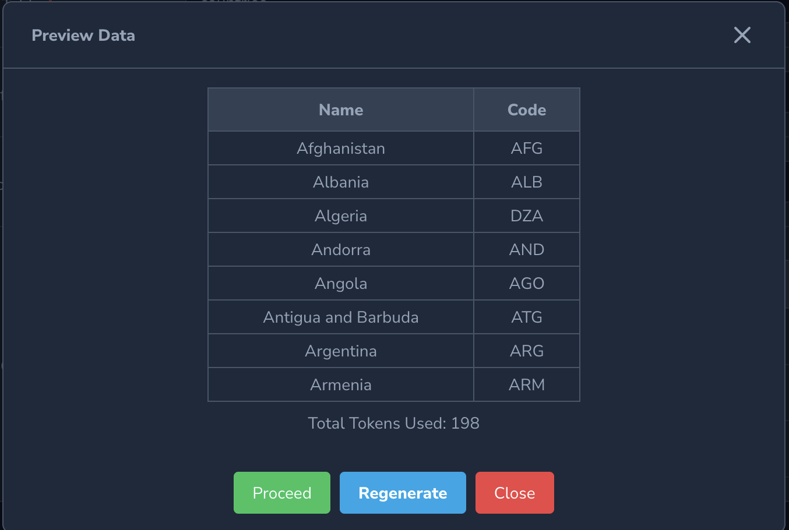

## ChatGPT Seeder

A powerful tool that leverages the capabilities of ChatGPT to automate the generation of realistic and meaningful data for your database seeding need.

## Features
- Database Seeding: Easily seed tables with real or fake data.
- Data Type Selection: Choose between real data or fake data generation.
- Table Selection: Select target tables for seeding.
- Custom Record Count: Set the number of records to seed.
- Column Selection: Choose specific columns for data insertion.
- Nullable Column Handling: Automatic handling of non-nullable columns.
- Data Description: Provide contextual information for accurate data generation.
- Retry Generation: Control the number of retries for accurate data results.
- API Integration: Seamlessly integrate with data generation APIs.
- Configuration Flexibility: Customize API endpoint, key, and settings.
- User-friendly Interface: Intuitive and smooth user experience.

## Installation

You can install the package into a Laravel app that uses Nova 4 via composer:

```bash
composer require naif/chatgpt-seeder
```

Publish the package's configuration file

```
php artisan vendor:publish --provider="Naif\ChatgptSeeder\ToolServiceProvider" 
```

Add the below to .env file:

```
CHATGPT_SEEDER_API_KEY= (OpenAI API Key)
CHATGPT_SEEDER_MAX_TOKENS=1000
CHATGPT_SEEDER_GENERATE_RETRY=3
```


 
## Usage

Add the tool to NovaServiceProvider.php

```
  public function tools()
    {
        return [
            new ChatgptSeeder()
        ];
    }
```

## Configuration

ChatGPT Seeder's configuration file, located at config/chatgpt-seeder.php\
Allows you to set and customize:

- ChatGPT API Key
- Maximum tokens to be used for each request.
- Retry Count

Retry Count is used for limit trying a request data that is return not valid it will retry again until reach the max retry. To rewrite the data requirement description to get more accurate result.

## Steps

1- Access ChatGPT Seeder Tool from the Laravel Nova dashboard.\
2- Fill in the required information, such as:
- Data type (Real or Fake)
- Table Name
- Number of Records
- Data Required Description
- Column Names List.

3- Click the "Generate" button to initiate the data generation process.\
4- Data Preview will show up displaying the first 8 records.\
5- Click Proceed to insert data to table Or click on Regenerate again until you are satisfied with the result.

## Screenshots




## Support:
naif@naif.io

https://naif.io

Bug Tracker:

https://github.com/naifalshaye/chatgpt-nova4/issues

## License

The MIT License (MIT). Please see [License File](LICENSE.md) for more information.
